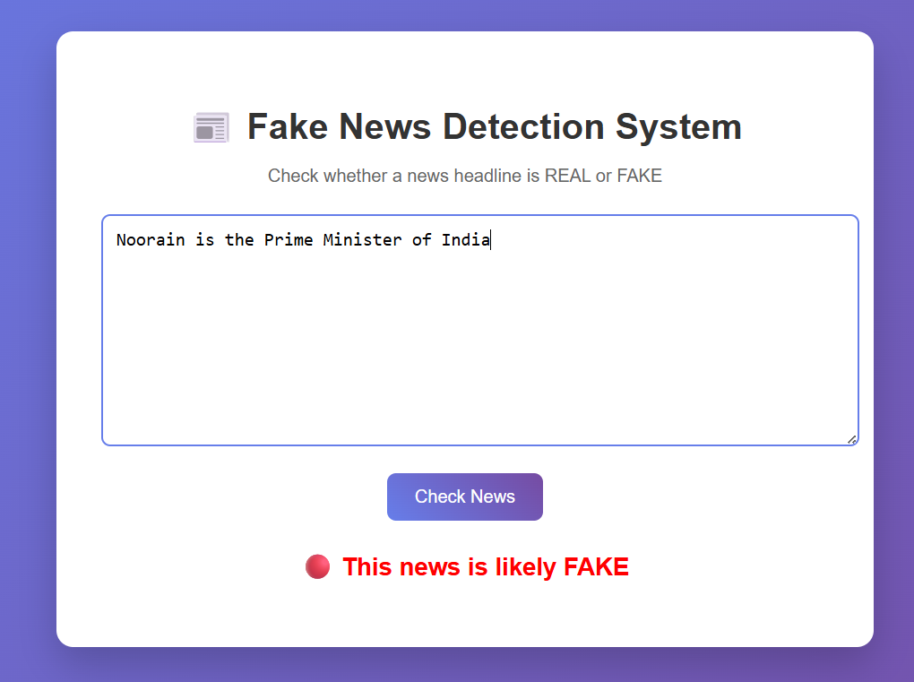
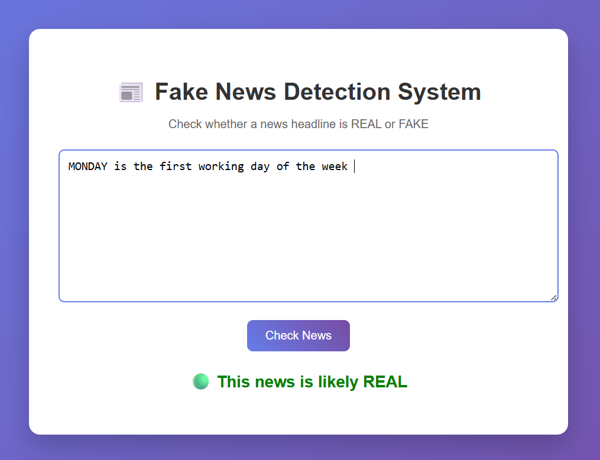

# 📰 Fake News Detection Web App

A Machine Learning-based web application that predicts whether a news article is **Real or Fake** using Natural Language Processing (NLP) techniques.

---

## 🚀 Features

* 🔍 Detects fake vs real news instantly
* 🧠 Uses Machine Learning (Logistic Regression)
* 📝 Text preprocessing with NLP (stemming, stopwords removal)
* 🌐 Simple and clean web interface using Flask
* ⚡ Fast and lightweight

---

## 🛠️ Tech Stack

* **Frontend:** HTML, CSS
* **Backend:** Python, Flask
* **Machine Learning:** Scikit-learn
* **NLP:** NLTK
* **Other Tools:** Pandas, Pickle

---

## 📂 Project Structure

```
FakeNewsWebsite/
│── static/
│   └── style.css
│── templates/
│   └── index.html
│── app.py
│── model.py
│── train_model.py
│── model.pkl
│── vectorizer.pkl
│── .gitignore
```

---

## ⚙️ Installation & Setup

### 1️⃣ Clone the repository

```
git clone https://github.com/your-username/FakeNewsDetection-ML-.git
cd FakeNewsDetection-ML-
```

### 2️⃣ Create virtual environment

```
python -m venv venv
```

### 3️⃣ Activate virtual environment

**Windows (PowerShell):**

```
.\venv\Scripts\Activate
```

### 4️⃣ Install dependencies

```
pip install -r requirements.txt
```

### 5️⃣ Download NLTK data

```
python
>>> import nltk
>>> nltk.download('stopwords')
```

---

## ▶️ Run the Application

```
python app.py
```

Then open:

```
http://127.0.0.1:5000/
```

---

## 📊 Dataset

The dataset used for training is **not included in this repository** due to size limitations.

👉 You can download it from:

* Kaggle (Fake News Dataset)
* Or your own dataset

---

## 🧠 Model Details

* Algorithm: Logistic Regression
* Vectorization: TF-IDF
* Text preprocessing:

  * Lowercasing
  * Removing special characters
  * Stopword removal
  * Stemming

---

## 📸 Screenshots

### ❌ Fake News Prediction


### ✅ Real News Prediction



---

## 📌 Future Improvements

* Add deep learning models (LSTM, BERT)
* Improve UI/UX
* Deploy online (Render / Heroku)
* Add API support

---

## 🤝 Contributing

Contributions are welcome! Feel free to fork this repo and submit a pull request.

---

## 📜 License

This project is open-source and available under the MIT License.

---

## 🙋‍♀️ Author

**Noorain Fathima**

* GitHub: https://github.com/Noorain-Fathima
* LinkedIn: https://www.linkedin.com/in/noorain-fathima-35935032b

---

⭐ If you like this project, give it a star!
